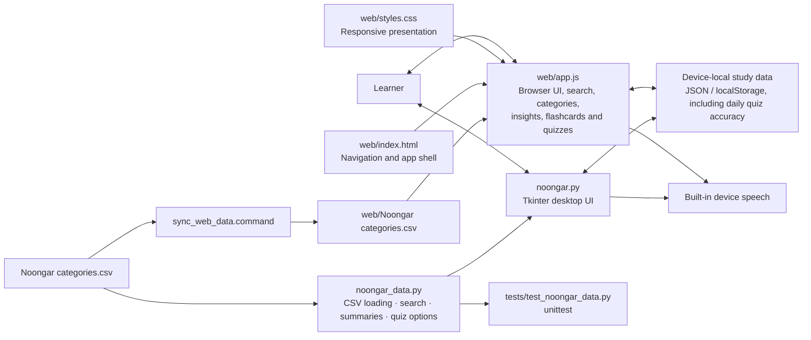

# Application architecture

The desktop app reads the source CSV through the shared Python data module.
When the CSV changes, `sync_web_data.command` copies it into the static web
folder. The browser app fetches that copy directly and implements its own CSV
reader because it runs without a Python server. The chart in each interface
summarises category entry counts; it does not infer word frequency or cultural
significance. Both applications keep learner progress and per-calendar-day
quiz results on the user's device. Daily accuracy combines all quiz questions
answered on that date; dates with no quiz answers have no chart point.
